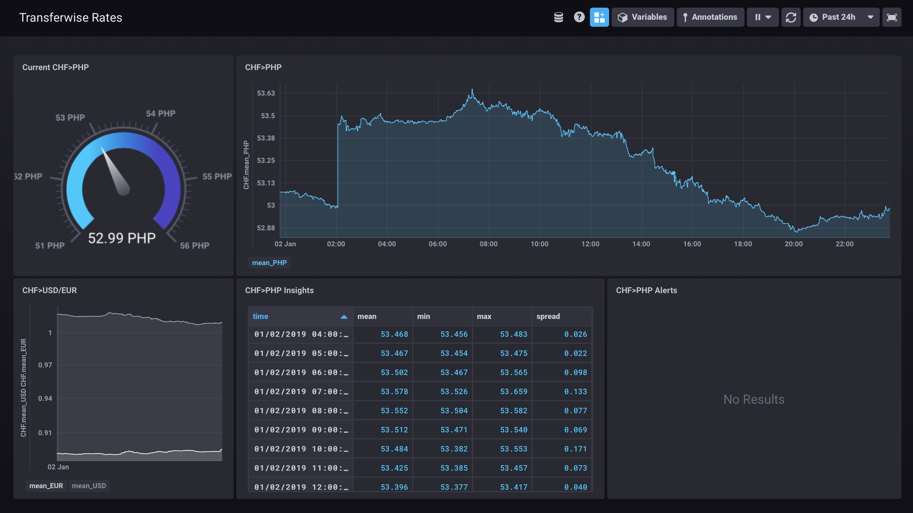

# Transferwise Exchange Rates Dashboard

- Tracks all Transferwise *CHF* exchange rates using the [TICK-Stack](https://www.influxdata.com/time-series-platform/).
- Deployed on a Raspberry Pi with [Balena](https://www.balena.io) (see Balena-compatible `docker-compose.yml`).
- Currency specific Kapacitor alerts (i.e. to Slack) can be set in [Chronograf](https://docs.influxdata.com/chronograf/v1.7/guides/create-alert-rules/).
- Retention Policy: 14 days.

### Environment Variables

If using Balena set the following device specific Device Service Variables:

- `API_TOKEN` for Transferwise API.

*Optional*: OAuth w/ Github, see [Chronograf documentation](https://docs.influxdata.com/chronograf/v1.7/administration/managing-security/#configuring-github-authentication):

- `GH_CLIENT_ID`
- `GH_CLIENT_SECRET`
- `GH_ORGS`
- `TOKEN_SECRET`

### Deployment w/ Balena
    # git add remote for project
    git push balena master

### Linting
    pipenv run black .
